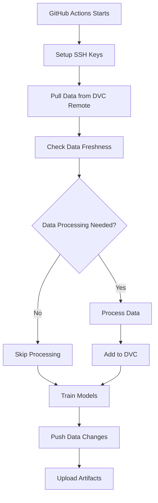

# DVC CI/CD Setup Guide

This guide explains how to set up Data Version Control (DVC) with GitHub Actions for your MLOps project.

## 🔧 Prerequisites

1. **GitHub Repository**: Your main project repository (`mlops-assignment`)
2. **DVC Data Repository**: A separate repository for data storage (`mlops-assignment-data`)
3. **SSH Keys**: For secure access to the data repository

## 📋 Setup Steps

### 1. Create DVC Data Repository

1. Go to GitHub and create a new repository:
   - **Name**: `mlops-assignment-data`
   - **Description**: Data storage for MLOps project
   - **Visibility**: Private (recommended for sensitive data)
   - **Don't initialize** with README, .gitignore, or license

### 2. Generate SSH Key for CI/CD

Generate a dedicated SSH key for GitHub Actions:

```bash
# Generate SSH key (don't use a passphrase for CI/CD)
ssh-keygen -t ed25519 -C "github-actions-dvc" -f ~/.ssh/dvc_deploy_key -N ""

# This creates:
# - ~/.ssh/dvc_deploy_key (private key)
# - ~/.ssh/dvc_deploy_key.pub (public key)
```

### 3. Configure SSH Keys

#### Add Deploy Key to Data Repository

1. Copy the **public key**:
   ```bash
   cat ~/.ssh/dvc_deploy_key.pub
   ```

2. Go to your **data repository** (`mlops-assignment-data`):
   - Settings → Deploy keys → Add deploy key
   - **Title**: `GitHub Actions DVC Access`
   - **Key**: Paste the public key content
   - ✅ **Allow write access** (important!)
   - Click "Add key"

#### Add Private Key to Main Repository Secrets

1. Copy the **private key**:
   ```bash
   cat ~/.ssh/dvc_deploy_key
   ```

2. Go to your **main repository** (`mlops-assignment`):
   - Settings → Secrets and variables → Actions → New repository secret
   - **Name**: `DVC_SSH_PRIVATE_KEY`
   - **Secret**: Paste the entire private key content (including headers)
   - Click "Add secret"

### 4. Test DVC Setup Locally

Before pushing to CI/CD, test the setup:

```bash
# Push data to DVC remote
python -m dvc push

# Test by removing and pulling data
rm data/raw/california_housing.csv data/processed/cleaned.csv
python -m dvc pull

# Verify files are restored
ls -la data/raw/ data/processed/
```

### 5. Commit and Push Changes

```bash
# Commit the updated CI/CD workflow
git add .github/workflows/ci.yml
git commit -m "Update CI/CD pipeline to use DVC remote storage

- Add SSH key setup for DVC data repository access
- Replace manual data download with DVC pull
- Add intelligent data processing with change detection
- Include DVC push for data changes
- Add proper caching for DVC data and artifacts"

# Push to trigger the CI/CD pipeline
git push origin master
```

## 🔄 How It Works in CI/CD

### Data Flow



### Key Features

1. **🔐 Secure Access**: Uses SSH keys for private repository access
2. **⚡ Smart Caching**: Caches DVC data to speed up builds
3. **🔄 Change Detection**: Only reprocesses data when needed
4. **📤 Auto Push**: Pushes data changes back to remote
5. **🛡️ Error Handling**: Graceful handling of missing files/permissions

## 🚨 Troubleshooting

### Common Issues

#### 1. SSH Permission Denied
```bash
Error: Permission denied (publickey)
```
**Solution**: 
- Verify the deploy key is added to the data repository
- Ensure "Allow write access" is checked
- Check the private key secret is correctly formatted

#### 2. DVC Remote Not Found
```bash
Error: failed to pull data from the cloud
```
**Solution**:
- Ensure the data repository exists
- Run `dvc push` locally first to initialize the remote
- Check the remote URL in `.dvc/config`

#### 3. Data Files Missing
```bash
Error: No such file or directory
```
**Solution**:
- Run `dvc pull` locally to ensure data exists in remote
- Check if data files are properly tracked with `dvc status`

### Debug Commands

```bash
# Check DVC status
python -m dvc status

# Check remote configuration
python -m dvc remote list

# Test remote connectivity
python -m dvc pull --verbose

# Check what files are tracked
find . -name "*.dvc" -exec echo {} \;
```

## 📊 Monitoring

### GitHub Actions Logs

Monitor the CI/CD pipeline progress:

1. **DVC Pull**: Should show data files being downloaded
2. **Data Verification**: Lists files in data directories
3. **Smart Processing**: Shows if data processing was skipped or executed
4. **DVC Push**: Indicates if any changes were pushed back

### Expected Log Output

```bash
✅ Data files verified
✅ Processed data is up to date  # or "Data processing complete"
✅ Training & registration complete
No changes to push to DVC remote  # or "Pushed X files"
```

## 🔧 Advanced Configuration

### Custom DVC Remote

To use a different remote (S3, GCS, etc.), update `.dvc/config`:

```ini
[core]
    remote = myremote
['remote "myremote"']
    url = s3://my-bucket/dvc-storage
```

### Branch-Specific Data

For different data per branch:

```yaml
- name: Pull data from DVC remote
  run: |
    python -m dvc pull --remote origin-${{ github.ref_name }}
```

## 🎯 Best Practices

1. **🔒 Security**: Use private repositories for sensitive data
2. **📦 Size Limits**: GitHub has repository size limits (~1GB recommended)
3. **🗂️ Organization**: Keep data repository separate from code
4. **🔄 Versioning**: Tag data versions alongside model versions
5. **🧹 Cleanup**: Regularly clean up old artifacts and cache

## 📚 Additional Resources

- [DVC Documentation](https://dvc.org/doc)
- [GitHub Actions SSH Setup](https://docs.github.com/en/developers/overview/managing-deploy-keys)
- [MLOps Best Practices](https://ml-ops.org/)

---

**Your DVC CI/CD integration is now ready for production MLOps workflows! 🚀** 