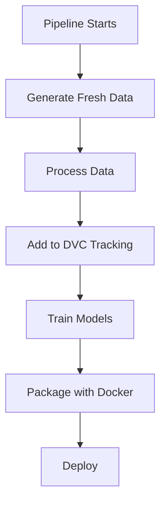

# DVC Local-Only Configuration

## Overview

This project uses DVC for local data versioning without remote storage. Data is generated fresh in each CI/CD pipeline run, ensuring the latest data is always used for model training and Docker image packaging.

## Configuration

### Local DVC Setup

**File**: `.dvc/config`
```ini
[core]
    remote = local
```

This configuration keeps all data local without any remote storage dependencies.

## Benefits

1. **✅ Simplified Setup**: No remote storage configuration needed
2. **✅ Fresh Data**: Each pipeline run generates the latest data
3. **✅ No Authentication Issues**: No need for service accounts or tokens
4. **✅ Reliable CI/CD**: Pipeline always uses current data
5. **✅ Cross-Platform**: Works on Windows, macOS, Linux without issues

## Setup Instructions

### For Local Development

**Generate and process data:**
```bash
# Download raw data
python scripts/download_data.py

# Process data
python src/data/data_ingestion.py

# Add to DVC tracking (local only)
dvc add data/raw/california_housing.csv data/processed/cleaned.csv
```

### For CI/CD

The pipeline automatically:
1. Generates fresh data using `scripts/download_data.py`
2. Processes data using `src/data/data_ingestion.py`
3. Adds data to DVC tracking
4. Uses the latest data for model training
5. Packages the data with the Docker image

## Data Flow



## Testing

### Local Testing
```bash
# Generate and process data
python scripts/download_data.py
python src/data/data_ingestion.py

# Add to DVC tracking
dvc add data/raw/california_housing.csv data/processed/cleaned.csv

# Train models
python src/models/train.py

# Test API
python -m uvicorn src.api.app:app --host 127.0.0.1 --port 8000
```

### CI/CD Testing
The pipeline automatically:
1. Generates fresh data
2. Processes data
3. Trains models
4. Builds Docker image with latest data
5. Deploys the application

## Troubleshooting

### Common Issues

1. **"Data files missing"**: Run `python scripts/download_data.py`
2. **"DVC not tracking files"**: Run `dvc add data/raw/california_housing.csv data/processed/cleaned.csv`
3. **"Processing errors"**: Check data format in `src/data/data_ingestion.py`

### Solutions

1. **Regenerate data**: Always run the download script first
2. **Check DVC status**: Use `dvc status` to see tracked files
3. **Verify data format**: Ensure data files are in the correct format

This simplified approach ensures reliable data handling across all platforms and CI/CD environments.
